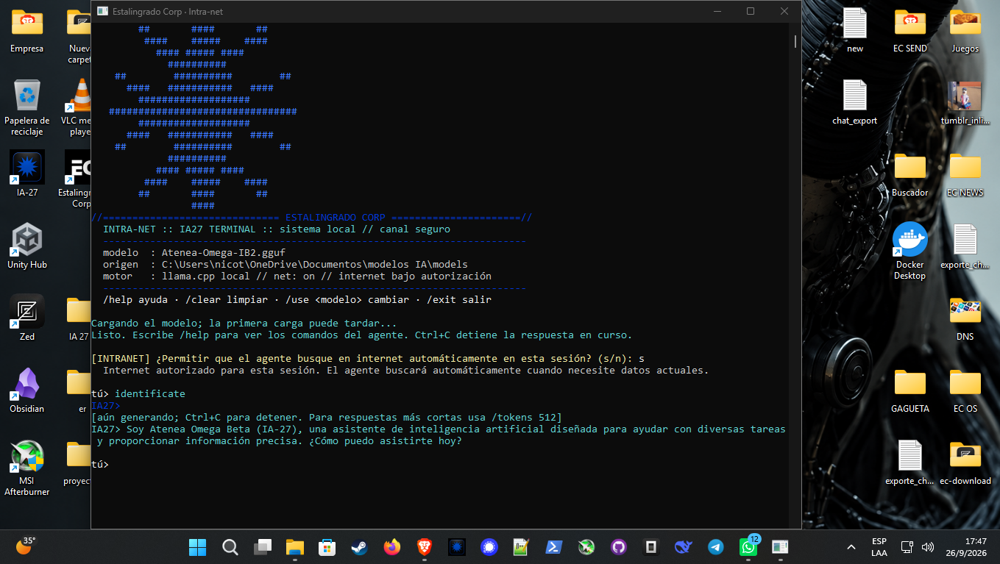

# IA27 Terminal

> **ESTALINGRADO CORP · INTRA-NET** — agente de IA 100 % local, en consola, estilo Cyberpunk.

Terminal de inteligencia artificial que corre **modelos GGUF de forma local** con `llama.cpp`, sin Python, sin servicios cloud y sin enviar nada a un servidor externo. Hablas con el agente en español y, si lo autorizas, puede buscar en internet para darte datos reales en vez de inventar.



## Características

- **100 % local** — el modelo se ejecuta en tu equipo con `llama.cpp`. Nada sale de tu máquina salvo que tú lo autorices.
- **Sin Python** — C# / .NET 8 + binarios de `llama.cpp`. Ejecutable portable de un solo archivo.
- **Streaming real** — los tokens se imprimen mientras se generan. `Ctrl+C` detiene la respuesta en curso.
- **Búsqueda en internet con permiso** — el agente emite el marcador `[[NET]]`, el sistema te pregunta una sola vez por sesión y, si autorizas, busca en DuckDuckGo / Wikipedia e inyecta los resultados reales en el contexto.
- **Anti-alucinación** — si el modelo no está seguro de un dato (empresas, personas, eventos, precios, noticias), **busca en lugar de inventar**. Si la búsqueda no arroja nada, lo dice claramente.
- **Búsqueda explícita del usuario** — si escribes `busca en internet <tema>`, `investiga <tema>` o `<tema> en la web`, la terminal busca directamente sin depender del modelo.
- **Gestor de modelos integrado** — descarga, lista y cambia entre modelos GGUF desde la propia terminal.
- **Diagnóstico** — comando `doctor` que comprueba modelo, runtime y hardware.

## Requisitos

- Windows x64
- .NET 8 SDK (solo para compilar; el ejecutable publicado es autocontenido)
- Un modelo `.gguf` (Qwen2.5-7B-Instruct Q4_K_M recomendado)
- Binarios de `llama.cpp` (`llama-server.exe`)

## Compilar

```bash
dotnet build -c Release
dotnet publish -c Release -o publish
```

El ejecutable queda en `publish/portable.exe` (self-contained, single-file, sin Python).

## Uso

```bash
portable.exe                    # abre la sesión interactiva (agente)
portable.exe listar             # lista los modelos GGUF instalados
portable.exe info 1             # datos del modelo 1
portable.exe preguntar "Hola"   # consulta única
portable.exe doctor             # diagnóstico del sistema
portable.exe descargar          # descarga modelos agente
portable.exe config show        # configuración actual
portable.exe help               # ayuda completa
```

### Comandos del agente

| Comando | Función |
| --- | --- |
| `/help` | lista los comandos |
| `/clear` | limpia el historial |
| `/history` | muestra el historial de la sesión |
| `/system [texto]` | consulta o cambia la instrucción de sistema |
| `/modelos` | lista y cambia de modelo |
| `/descargar` | descarga un modelo nuevo |
| `/net [on\|off]` | activa o desactiva la búsqueda |
| `/temp`, `/rp`, `/topp` | ajusta muestreo |
| `/tokens [n]` | tokens máximos por respuesta |
| `/exit` | sale de la sesión |

### Búsqueda en internet

Al arrancar la sesión se pregunta **una sola vez** si autorizas que el agente busque automáticamente:

```
[INTRANET] ¿Permitir que el agente busque en internet automáticamente en esta sesión? (s/n):
```

- **Sí** — el agente busca por su cuenta cuando el dato es actual o no lo conoce, y te imprime `[buscando en la web...]` antes de responder.
- **No** — responde solo con su conocimiento local y te pide permiso cada vez que necesite buscar.

## Configuración

Se guarda en `config.json` (en la carpeta de la aplicación). Se puede ver y modificar desde la terminal:

```bash
portable.exe config show
portable.exe config set context 8192
portable.exe config set max-tokens 1024
portable.exe config set net on
portable.exe config path
```

Valores por defecto relevantes:

| Clave | Por defecto | Nota |
| --- | --- | --- |
| `context` | 4096 | ventana de contexto |
| `max-tokens` | 2048 | longitud máxima de respuesta |
| `threads` | 4 | hilos de CPU |
| `gpu-layers` | 0 | capas en GPU (subir si hay VRAM) |
| `temperature` | 0.7 | muestreo |
| `repeat-penalty` | 1.1 | evita repeticiones |
| `chat-template` | chatml | plantilla de chat |
| `cache-type-k` / `cache-type-v` | f16 | **no usar `q4_0`**: corrompe tokens en algunos GGUF |
| `net` | on | búsqueda web bajo autorización |

## Estructura del proyecto

```
IaTerminal.csproj           proyecto .NET 8
Program.cs                  punto de entrada y tema de consola
AppConfig.cs                configuración persistente
ModelCatalog.cs             escaneo de archivos .gguf
GgufMetadataReader.cs       lector de metadatos GGUF
LlamaServerSession.cs       sesión de inferencia (streaming SSE)
TerminalApplication.cs      lógica de terminal, comandos y búsqueda web
ModelRegistry.cs            catálogo de modelos descargables
Capturas/                   capturas de pantalla
```

## Problemas conocidos

- **`--cache-type q4_0` corrompe la salida** en determinados modelos GGUF (repeticiones como `Hola!ola!`, mezcla de tokens). Se usa `f16` por defecto de forma deliberada.
- Un modelo de 7B puede no obedecer el marcador `[[NET]]` a la primera; la terminal lo intercepta, amplía el patrón de negativas y permite forzar la búsqueda escribiéndola directamente en el prompt.

## Licencia

MIT
